## LABORATORIO3

### Part 1: Adding Security Configuration:

1. Add the following dependencies to your *build.gradle*:
  
  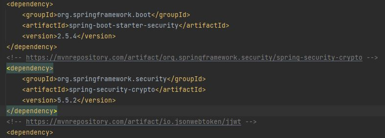
  
2. Create a new class inside the *config* package called *SecurityConfiguration* where you will define the secure and
   open endpoints and the session management policy:

     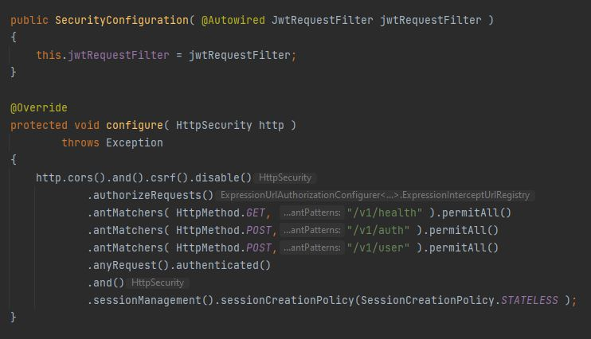
     
3. Start your server and verify that the configuration works as expected:

   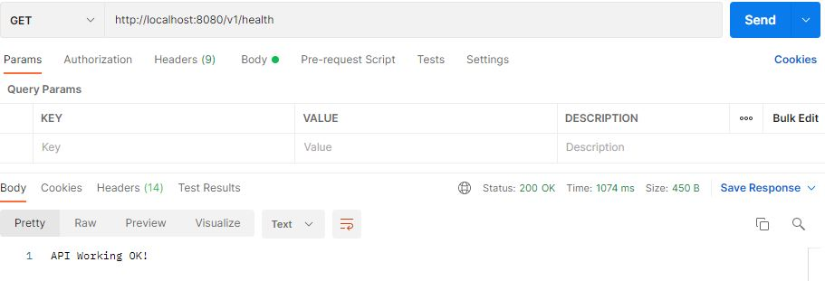

### Part 2: Implementing the Authentication Controller

1. Create a new package called *auth* inside the *controller* package.
2. Create a new class called *LoginDto* that you will use to map the JSON send to authenticate a user:
   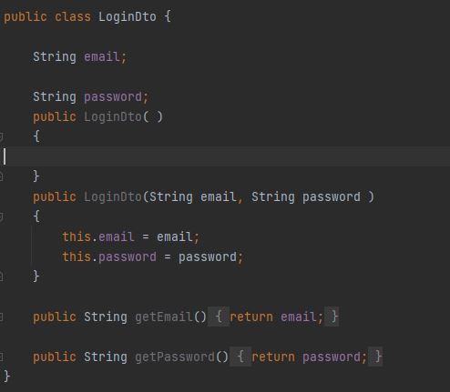
3. Create a new class called *TokenDto* that you will use to return the token and expiration date when the
   authentication is successful.

   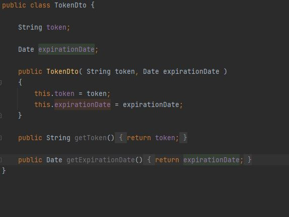
   
4. Create a new exception class inside the *exception* package called *InvalidCredentialsException*:
   
 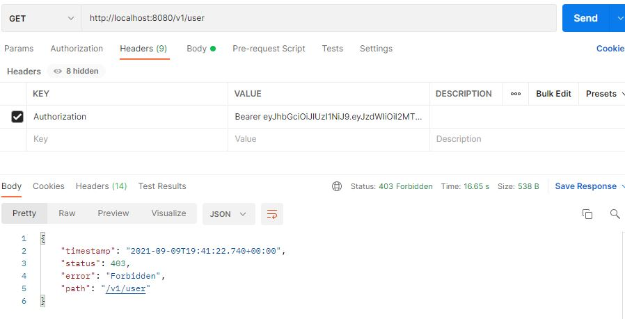

5. Crate a new Rest Controller class inside the *controller.auth* package called *AuthController*

   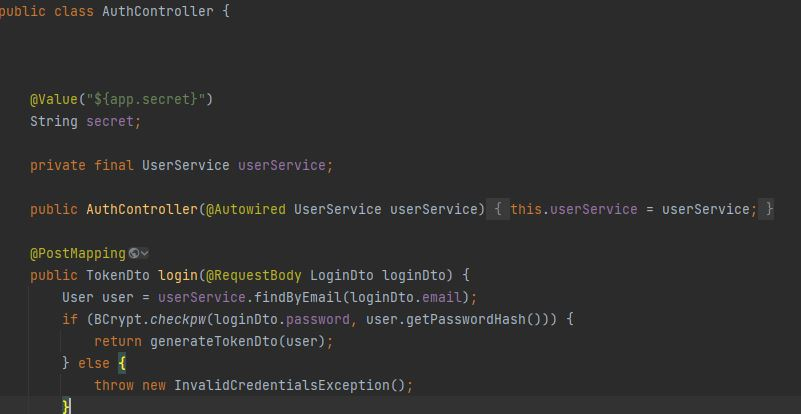
   
6. Add the */v1/user/* endpoint temporary to the *SecurityConfiguration* so you can access the endpoint to create a test
   user.
   
   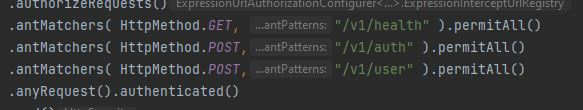
   
7. Verify the authentication endpoint by sending the credentials of the user created in 5.

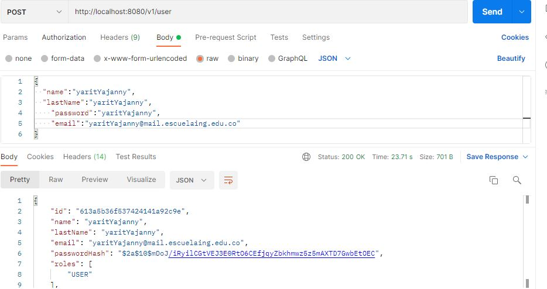

### Part 3: Implement JWT Request Filter

This filter will help you verify the authroization token send on the request authorization header or using a Cookie.

1. Implement an *AbstractAuthenticationToken* that will facilitate the process of handling endpoints access based on
   user roles. Create a new class called *TokenAuthentication* inside the *config* package:

   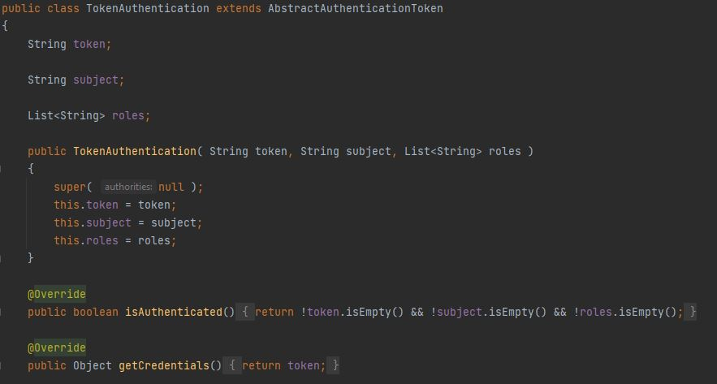
   
2. Create a new class inside the *config* package called *JwtRequestFilter*:

   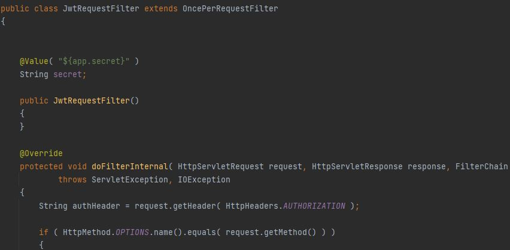
   
3.Modify the *SecurityConfiguration* class to include the *JwtRequestFilter*:

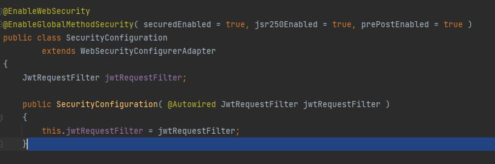

5. Add the following annotation to the DELETE user endpoint below the *@PostMapping* annotation. This will help you
   
   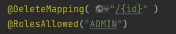
   
6. Run the project and verify that it works as expected following these steps:
   * Start the server.
   * Send a POST request to the auth endpoint using the credentials of your test user.
   * Copy the token from the response.
   * Make a new GET request to the *user* endpoint adding the *Autorization header* with the word *Bearer* as this
     
     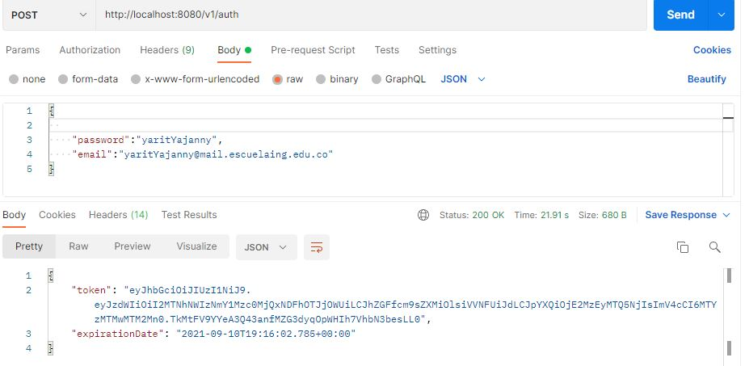
     
     
### Challenge Yourself: Implement a mechanism to support Application tokens

1. Implement a new method in the *AuthController* that receives an encrypted secret and verify that the secret is the
   same that you have locally using a new environment variable. If the secret match then you will generate a token that
   will allow the server to have *ADMIN* role token for 10 minutes.

   ***Tip***: Divide this problem into smaller problems. Once you solve each problem test your solution and only continue
   if it works.

    

